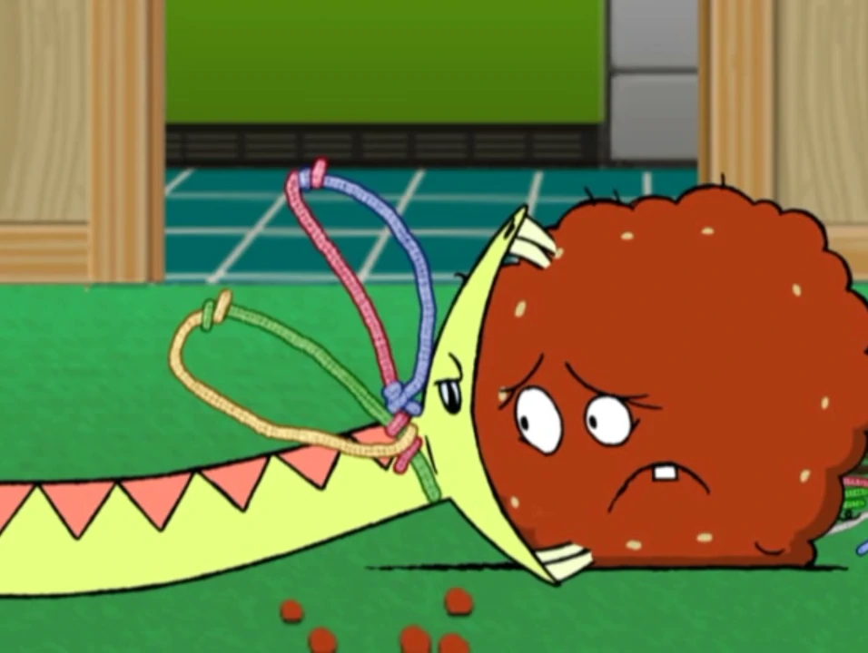

# Nathan Bot Philips 

Just some experimental code to teach a LSTM network to play rocket league. The
bulk of this code is copied from Impossibum's [Rocket League Reinforcement
Learning Bot Quick Start Tutorial
Guide](https://www.youtube.com/watch?v=C92_UFZ1W-U), with some custom rewards applied.

This model is currently in training, but I'll push the checkpoints as it goes.
